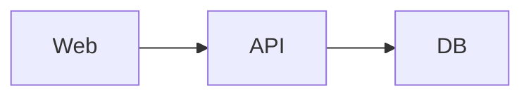

# Rule: Documentation

> Documentación es código. Sin docs claras, los devs nuevos pierden tiempo y reinventan ruedas.

## Reglas no negociables

### R1. Documentación va en `docs/`, no en raíz

Estructura:
```
docs/
├── audit/                  # Auditorías técnicas
│   └── PLATFORM_AUDIT.md
├── product/                # Visión y casos de uso
│   ├── PRODUCT_FOUNDATION.md
│   └── COMPETITOR_RESEARCH.md
├── architecture/           # Decisiones técnicas
│   ├── ARCHITECTURE.md
│   ├── rbac-matrix.md
│   └── adr/                # Architecture Decision Records
│       ├── ADR-001-multi-tenancy.md
│       ├── ADR-002-loyalty-ledger.md
│       └── ...
├── roadmap/
│   └── ROADMAP.md
├── DEPLOYMENT.md           # cómo desplegar
└── archive/                # docs viejos (no borrar, archivar)
```

**Excepciones permitidas en raíz**:
- `README.md` — overview de 1 página
- `CLAUDE.md` — guía para Claude
- `PROJECT_STATUS.md` — archivo vivo
- `LICENSE`, `.gitignore`, `docker-compose.yml`, etc. (no son docs)

### R2. ADRs para decisiones arquitectónicas

Cada decisión que afecta arquitectura, dependencies, o trade-offs significativos requiere ADR.

Formato (template):
```markdown
# ADR-00X: [Título corto, imperativo]

## Status
Proposed | Accepted | Deprecated | Superseded by ADR-00Y

## Context
[Qué problema o decisión enfrentamos. 1-2 párrafos.]

## Decision
[Qué decidimos hacer. Concreto.]

## Consequences
- Positivas: ...
- Negativas / trade-offs: ...
- Riesgos: ...

## Alternatives Considered
[Qué otras opciones se evaluaron y por qué se descartaron.]
```

Usar skill `/write-adr` para crear con número auto-incrementado.

### R3. README.md raíz: 1 página máxima

Solo:
- Qué es el proyecto (3-4 líneas)
- Quick start (clone → docker-compose up → done)
- Links a docs/ y CLAUDE.md

NO repetir info que ya está en `CLAUDE.md`, `PROJECT_STATUS.md`, o `docs/`.

### R4. `PROJECT_STATUS.md` se actualiza al cerrar fase o tomar decisión

Usar skill `/update-project-status`. Incluye: fecha, fase actual, decisiones tomadas, blockers, próximos pasos.

### R5. Reglas en `.claude/rules/` son la fuente de verdad operativa

Para el día a día. Si una regla cambia, **actualizar el archivo correspondiente**. NO duplicar info entre `.claude/rules/` y `docs/`.

`.claude/rules/` responde "¿cómo hago X correctamente?"
`docs/` responde "¿qué/por qué hacemos Y?"

### R6. Idioma

- **Código y comentarios**: inglés
- **Docs operativos** (rules, CLAUDE.md, ADRs cortos): inglés (más conciso)
- **Docs de producto** (PRODUCT_FOUNDATION, ROADMAP, AUDIT): español + términos técnicos en inglés (audiencia local mayormente española hoy)
- **PR descriptions y commits**: inglés

### R7. Markdown bien formado

- Headers con jerarquía clara (#, ##, ###)
- Tablas para data tabulada
- Code blocks con language tag (```ts, ```sql, ```bash)
- Listas con bullets o números (no mezclar arbitrariamente)
- Links relativos para refs internas: `[ver auth](../auth/auth.md)`

### R8. No usar emojis en docs serios (excepto status indicators)

✅ Aceptable: 🔴 🟡 🟢 ✅ ❌ ⚠️ en tablas de status o severity.

❌ Evitar: 🎉 🚀 ✨ 💪 (suenan a marketing, distraen).

### R9. Mantener TODOs out of code, in tracker

❌ **Mal**: `// TODO: implement loyalty ledger` dentro del código sin tracker.

✅ **Bien**: GitHub issue + label `roadmap-fase-3` + referencia en `ROADMAP.md`.

Excepción: TODOs muy locales y obvios (ej: `// TODO: bump qrcode.react to v4`).

### R10. Diagramas: ASCII art o Mermaid (no imágenes binarias)

Razones:
- Versionables con git
- Editables por cualquiera
- Sin necesidad de tooling externo

```
┌──────┐     ┌──────┐
│ Web  │────▶│ API  │
└──────┘     └──────┘
```

O Mermaid (renderiza en GitHub):


### R11. Documentar el "por qué", no solo el "qué"

❌ "Esta función crea un miembro" — obvio del nombre.

✅ "Esta función crea un miembro y lo asigna al tier bronze por defecto. El tier se recalcula automáticamente cuando supera 100 puntos."

### R12. Mantener docs sincronizada con código

Al hacer cambios significativos, actualizar docs en el mismo PR:
- Schema cambia → `database/schema.sql` + posiblemente `ARCHITECTURE.md`
- Nuevo endpoint → `rbac-matrix.md`
- Nueva feature flag → `PRODUCT_FOUNDATION.md`

### R13. Docs en código (JSDoc/TSDoc) solo donde aporta

❌ Redundante:
```ts
/**
 * Get all members
 * @param clubId The club ID
 * @param filters The filters
 */
async getAll(clubId: string, filters: any) { ... }
```

✅ Solo cuando agrega valor:
```ts
/**
 * Credits points to a member.
 * IMPORTANT: never modify points_balance directly — always go through this.
 * Throws AppError if member is inactive or club is suspended.
 */
async creditPoints(...) { ... }
```

## Comandos útiles

```bash
# Buscar docs sobre X
grep -ri "loyalty" docs/ .claude/

# Validar links rotos en markdown (futuro, si agregamos lychee o similar)
# lychee docs/

# Lint markdown
# npx markdownlint docs/
```

## Referencias

- ADR template: skill `/write-adr` lo genera
- Project status: `PROJECT_STATUS.md`
- Audit template: `docs/audit/PLATFORM_AUDIT.md` como referencia de estructura
